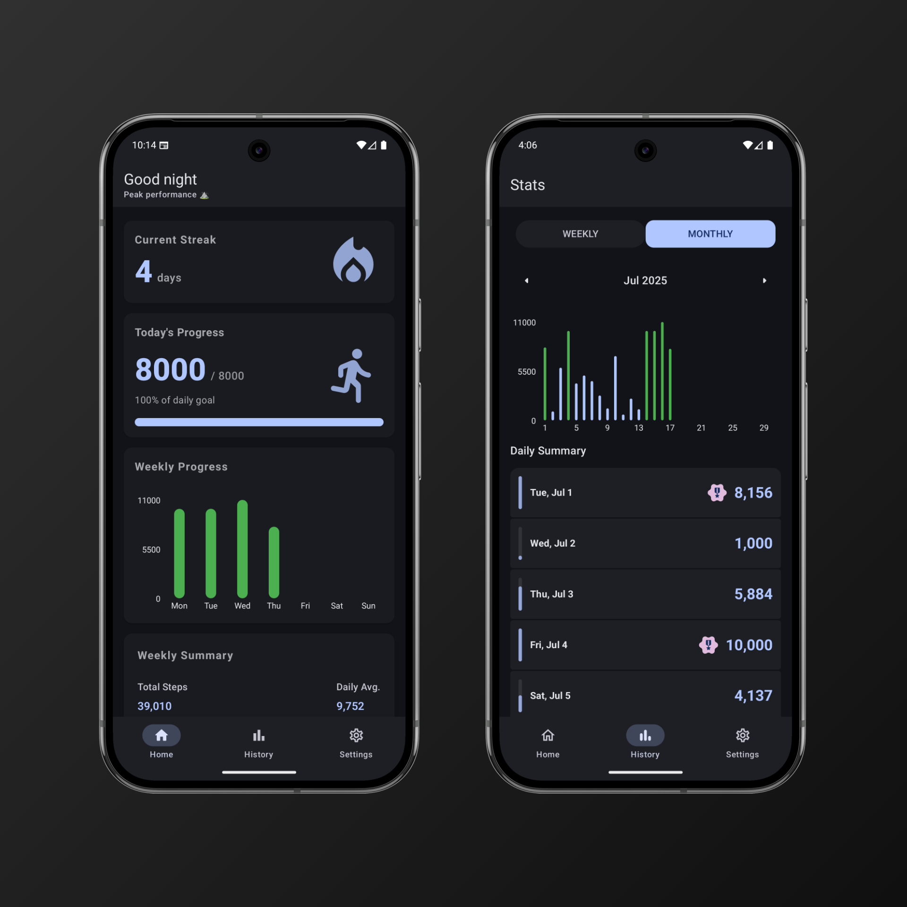
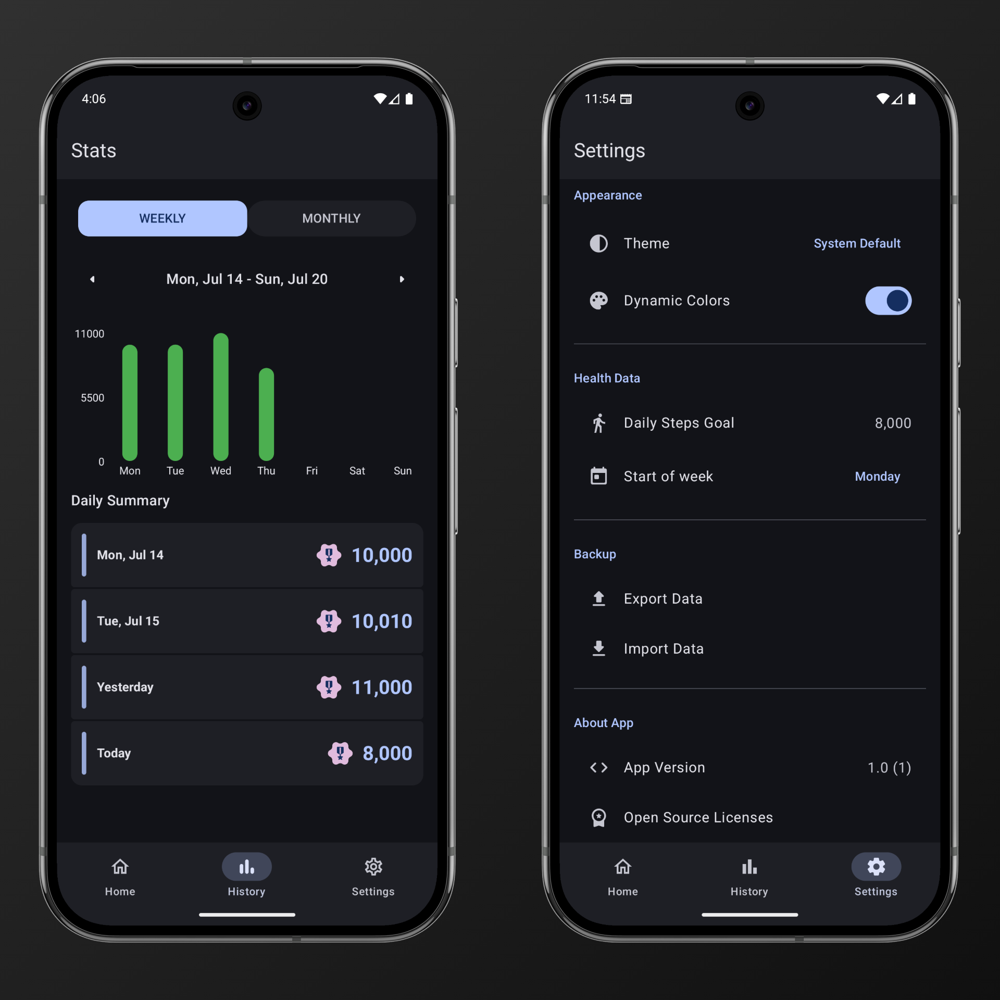
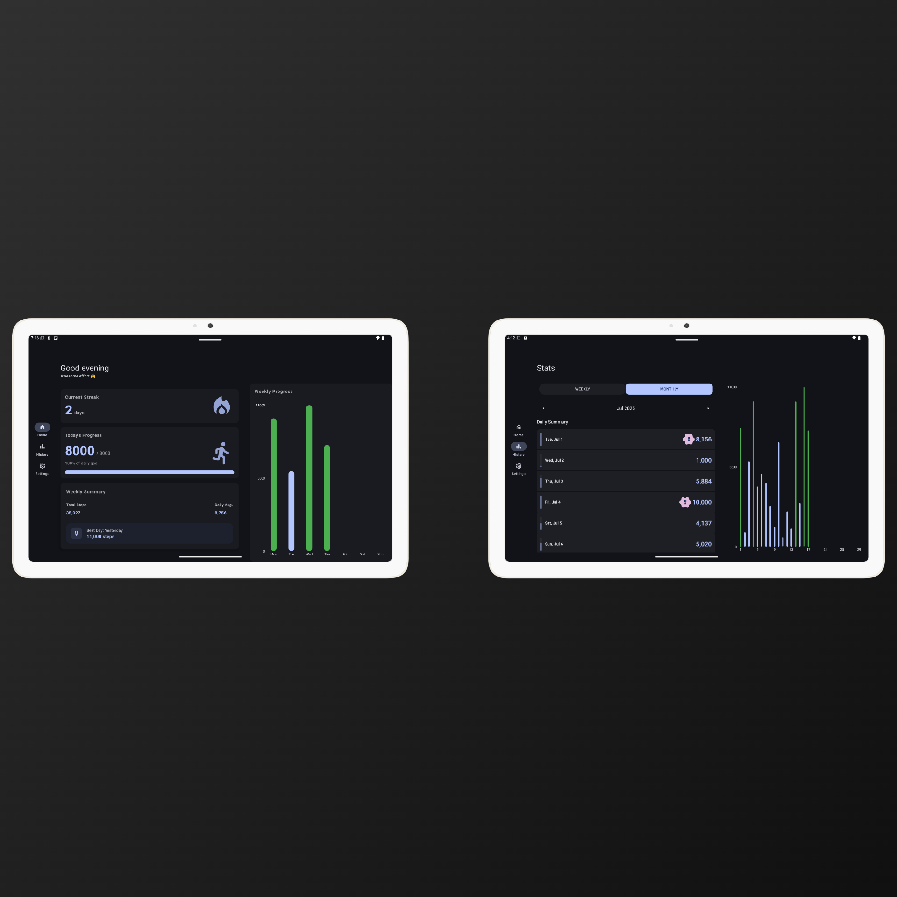
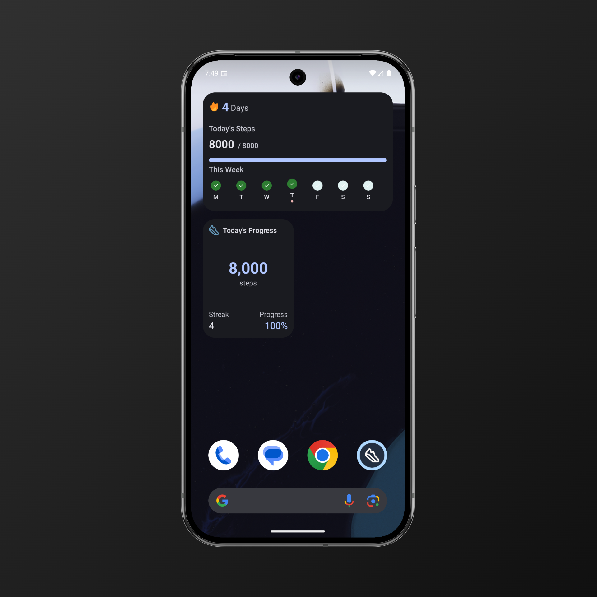

  
  <h1>Step Streak</h1>

# Step Streak

**Step Streak** is an Android app designed to keep you motivated by tracking your daily steps and streaks!  
It acts as a wrapper around **Health Connect**, seamlessly fetching step data from apps that write data to Health Connect, such as **Fitbit**, **Samsung Health**, and **Google Fit**.

## Features

- **Set a Daily Target**: Easily personalize your daily step goal right within the app.
- **Material 3 Expressive Design**: Enjoy a modern, visually appealing interface built with Material Design 3.
- **Widget Support**: Access your step count and streaks directly from your home screen.
- **Material Adaptive UI**: A clean, responsive design that looks great on both phones and tablets.

## Tech Stack

- **Kotlin**
- **Jetpack Compose**
- **Glance API**

## Screenshots

  

 

  

 

  

 

  

